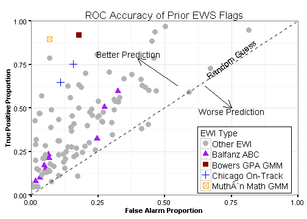

## The Problem in Predicting School Dropout

1. Student dropout is a phenomenon that has roots much earlier in the education 
pipeline than high school. 

2. Current early identification strategies are of unknown accuracy, difficult 
to implement, and rely on late breaking data. 

3. The predictors of dropout vary across jurisdictions, making one size fits 
all models inefficient, biased, or both. 

4. Teachers, counselors, principals, and other school staff are spending valuable 
time assessing student dropout likelihood using manual identification. 

**Early warning systems promise to reduce this burden and increase accuracy.**

## Outline

- Current state of early warning models
- A gentle introduction to machine learning
- Deploying machine learning models to educators
- Future challenges


## The What of Early Warning Systems

- An Early Warning System (EWS) is simply a predictive system seeking to 
explain the likelihood of a future outcome using data available today
- EWSs are common in many industries and have a number of other names -- predictive 
analytics, risk models, or machine learning
- In education the most common EWS projects the likelihood a student will dropout 
before completing high school
- Famous and successful examples include: The Chicago Consortium on School Research 
model, the BetterHighSchools.org EWI tool, and the Edwin Analytics suite in MA
- Existing EWS models fall into three broad categories -- checklist, regression, 
and mixture/latent variable models

## What does the research say? Checklist models {.small}

- Checklist models are easy to implement, have been shown to have high out-of-sample 
validity in some school settings (Heppen and Therriault, 2008; Kennelly and
Monrad, 2007; Easton and Allensworth, 2005 & 2007; Roderick and Camburn, 1999; 
Allensworth, 2013, Balfanz and Herzog, 2006; Balfanz and Iver, 2007)
- The downside of such checklist based systems is that they tend to overemphasize individual
attributes like grades or attendance at the risk of oversimplifying the mechanisms underlying
students’ risk of dropping out (Gleason and Dynarski, 2002). Often, educators are not given
a strong sense of how well such indicator systems perform and, thus, may not find it easy to
weigh the results of such a checklist against other evidence available to them through classroom
observation, student interactions, or a short interview with the student.

## What does the research say? Regression models

- Carl et al. (2013) use regression models to estimate a student’s probability of
high school completion conditional on the number and type of credits earned in the freshman
year. The authors’ conclude in creating a new measure, Total Quality Credits (TQC), whic is a
combination of course grades in the four core subjects and is highly predictive of both on-time
high school completion and college enrollment.
- Regression models have been shown to be flexible to multiple school contexts, 
but have higher data requirements


## What does the research say? Mixture/Latent Variable Models

- Most accurate models
- Muthen (2004). Bowers and Sprott (2012a) builds on this work by extending the GMM methodology
to a nationally representative data set (the Education Longitudinal Study of 2002) and tying
the model to existing theories of student disengagement and dropout. Bowers and Sprott
(2012a) found that even when limiting the GMM to data available to most school staff, the
model provides highly accurate predictions of individual students’ high school completion.
- Mixture/latent variable models are highly accurate, have demanding data requirements, 
and have not been proven out-of-sample (Muthen 2004)

## What do we want from an EWS?
- **Early** identification in time to make interventions
- **Accurately** identifying students who need assistance and those who do not
- **Transparency** in how predictions were made and how students are labeled
- **Reproducibility** in the predictions so they vary with changes in underlying behaviors 
not the models
- **Scaleable** to a diverse array of student and school contexts

## Comparing and contrasting apples to apples

- There has been too much inconsistency in the application of accuracy metrics
to make comparisons useful and to identify where such indicators draw the line between correct
classification of non-graduates and false alarm rates (Gleason and Dynarski, 2002; Jerald, 2006;
Bowers et al., 2013). 
- As Bowers et al. (2013) indicate, most of the 110 at-risk flags found in the 
literature only include a measure of the sensitivity, or the specificity, but rarely both. 
- In an effort to bring cohesion and clarity to the comparison of EWIs, Bowers
et al. (2013) calculated the performance metrics for 110 separate EWIs found in the 
literature.


## What does accuracy mean?

- Correct classification of a student as a future dropout means we cannot measure 
accuracy with a single number and be accurate
- Classification metrics must incorporate the trade-off between different types 
of misclassification

## Metrics of Model Fit

- In the continuous case, Root Mean Square Error (RMSE)
- In the discrete case, there are a number of options including kappa, 
ROC, AUC, and others
- ROC: Receiver Operating Characteristic, AUC: Area Under the (ROC) Curve
- Many of these metrics can be extended to the multi-class case as well

## Confusion Matrix: Classification

<table style="float:center">
<tr>
<td colspan="2" rowspan="2"></td>
<td colspan="2" style="background-color:#1b85b8">Actual</td>			
</tr>
<tr>
<td>Non-grad</td>
<td>Graduate</td>
</tr>
<tr>
<td rowspan="2" style="background-color:#ae5a41">Predicted</td>
<td>Non-grad</td>
<td><b>a</b></td>
<td><b>b</b></td>
</tr>
<tr>
<td>Graduate</td>
<td><b>c</b></td>
<td><b>d</b></td>
</tr>
</table>


Some performance metrics we can use:

- Accuracy: $\frac{(a+d)}{(a+b+c+d)}$
- Precision (positive predictive value) = $\frac{a}{(a+b)}$
- Sensitivity (recall) = $\frac{a}{(a+c)}$
- Specificity (negative predictive value) = $\frac{d}{(b+d)}$
- False alarm (1-specificity) = $\frac{b}{(b+d)}$

## Confusion Matrix: Accuracy

<table>
<tr>
<td colspan="2" rowspan="2"></td>
<td colspan="2" style="background-color:#1b85b8; border: 2px solid">Actual</td>			
</tr>
<tr>
<td>Non-grad</td>
<td>Graduate</td>
</tr>
<tr>
<td rowspan="2" style="background-color:#ae5a41; border: 2px solid">Predicted</td>
<td>Non-grad</td>
<td  style="background-color:#c3cb71; border: 2px solid"><b>a</b></td>
<td><b>b</b></td>
</tr>
<tr>
<td>Graduate</td>
<td><b>c</b></td>
<td style="background-color:#c3cb71; border: 2px solid"><b>d</b></td>
</tr>
</table>

- Accuracy: $\frac{(a+d)}{(a+b+c+d)}$
- Accuracy is a good measure if our classes are fairly balanced and we care about 
overall correctly dividing the data into the groups. 
- If one group is much larger than another though, this method can be misleading.

## Confusion Matrix: Precision

<table>
<tr>
<td colspan="2" rowspan="2"></td>
<td colspan="2" style="background-color:#1b85b8; border: 2px solid">Actual</td>			
</tr>
<tr>
<td>Non-grad</td>
<td>Graduate</td>
</tr>
<tr>
<td rowspan="2" style="background-color:#ae5a41; border: 2px solid">Predicted</td>
<td>Non-grad</td>
<td  style="background-color:#c3cb71; border: 2px solid"><b>a</b></td>
<td  style="background-color:#c3cb71; border: 2px solid"><b>b</b></td>
</tr>
<tr>
<td>Graduate</td>
<td><b>c</b></td>
<td><b>d</b></td>
</tr>
</table>

Precision (negative predictive value) = $\frac{a}{(a+b)}$

- Of all the cases we predict to be **non-graduates**, what proportion actually graduate?
- If we are interested in the **non-graduate** class, then this is a very useful metric 
to understand how good we are at identifying this group. Useful if this class is a rare 
class.

## Confusion Matrix: Sensitivity

<table>
<tr>
<td colspan="2" rowspan="2"></td>
<td colspan="2" style="background-color:#1b85b8; border: 2px solid">Actual</td>			
</tr>
<tr>
<td>Non-grad</td>
<td>Graduate</td>
</tr>
<tr>
<td rowspan="2" style="background-color:#ae5a41; border: 2px solid">Predicted</td>
<td>Non-grad</td>
<td  style="background-color:#c3cb71; border: 2px solid"><b>a</b></td>
<td ><b>b</b></td>
</tr>
<tr>
<td>Graduate</td>
<td style="background-color:#c3cb71; border: 2px solid"><b>c</b></td>
<td><b>d</b></td>
</tr>
</table>

Sensitivity (recall) = $\frac{a}{(a+c)}$

- Of all the **non-graduate** cases, what percentage do we correctly identify (recall)?
- Useful if we are interested in rare-event models where we want to accurately 
identify rare events, and are less worried about how accurate we are with the modal 
or common case. 

## Confusion Matrix: Specificity

<table>
<tr>
<td colspan="2" rowspan="2"></td>
<td colspan="2" style="background-color:#1b85b8; border: 2px solid">Actual</td>			
</tr>
<tr>
<td>Non-grad</td>
<td>Graduate</td>
</tr>
<tr>
<td rowspan="2" style="background-color:#ae5a41; border: 2px solid">Predicted</td>
<td>Non-grad</td>
<td><b>a</b></td>
<td style="background-color:#c3cb71; border: 2px solid"><b>b</b></td>
</tr>
<tr>
<td>Graduate</td>
<td><b>c</b></td>
<td style="background-color:#c3cb71; border: 2px solid"><b>d</b></td>
</tr>
</table>

- Specificity (positive predictive value) = $\frac{d}{(b+d)}$
- False alarm (1-specificity) = $\frac{b}{(b+d)}$
- Of all the **graduate** cases, what proportion actually do we predict correctly?
- If we are interested in one class, this metric is either interesting on its own, 
or as the balancing metric (false alarm) that we seek to hold constant while 
increasing our sensitivity. 

## Receiver Operating Characteristic


- ROC represents the tradeoff between the fraction of non-graduates identified out of 
all non-graduates, and the fraction of false non-graduates out of all graduates 
- Can support decision analysis by allowing a decision to be made explicitly about the 
balance between false-positives and false-negatives
- Excellent for optimizing rare-class identification

## What is out there? {.flexbox .vcenter}

<small>Adapted from Bowers, Sprott, and Taff 2013</small> 

<div class="centered">

</div>

## The DEWS Workflow

<div class="centered">

</div>


## Why accuracy? 

**Opportunity cost**

>- Accuracy matters tremendously at scale. 
>- 1,000 schools receiving on average 240 predictions each. 
>- Each prediction reviewed by 3-5 staff for ~5 minutes
>- 3 x 240 x $\frac{1}{12}$ = 60 hours
>- 5 x 240 x $\frac{1}{12}$ = 100 hours
>- Across 1,000 schools thats 60,000 to 100,000 hours of work 
>- This could cost from $1 million to $4 million annually

## Machine Learning

- In Wisconsin we are looking to make tens of thousands of bi-annual predictions and 
asking educators to pay attention to them
- Start with some more basic models, build complexity in order to increase 
accuracy

```{r echo=FALSE, fig.height=4, fig.width=5.5, fig.align='center', fig.cap="Figure Adapted from James et al. 2013", message=FALSE, warning=FALSE}
library(eeptools)
x    <- c(1, 2, 3, 4, 5, 6, 7, 8)
y    <- c(14, 12, 10, 8, 6, 4, 2, 0)

jitter <- function(x) x + runif(1, min=-.5, max=.5)
x <- sapply(x, jitter)
y <- sapply(y, jitter)

labs <- c("Lasso", "Subset Selection", "Least Squares", 
          "Generalized Linear Models", "KNN", "Trees", "Bagging, Boosting", 
          "SVM")

qplot(x, y, geom='text', label=labs) + theme_classic() + 
  scale_x_continuous("Flexibility", limits=c(min(x) - 0.5, max(x) + 0.5)) +
  scale_y_continuous("Interpretability", limits=c(min(y) - 0.5, max(y) + 0.5)) +
  labs(title="Functional Forms and Tradeoffs") + theme_dpi(base_size=16) +
  theme(axis.text=element_blank(), axis.ticks=element_blank())
```

## Some Early Results


## Challenges with Machine Learning 

- Hard to interpret results
- Difficult to get stability
- Concerns with the "black box"


## Overcoming those Challenges

- Communication, communication, communication
- Everyone agrees that accuracy is the priority, so the complexity is required
- Find ways to make complexity approachable, digestable, and trustable
- Transparency is key
